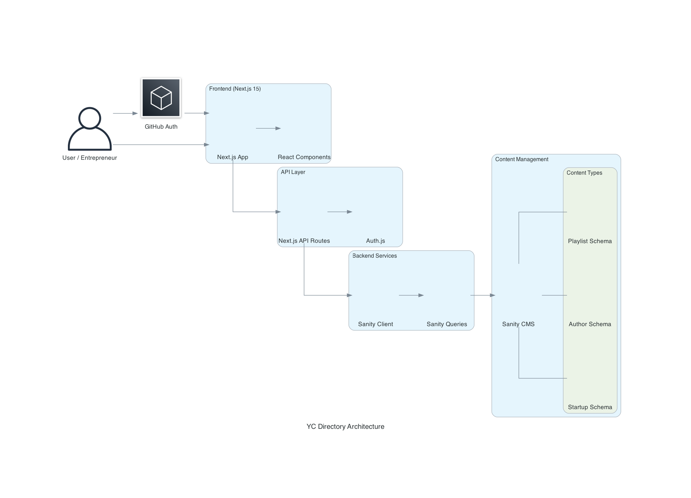
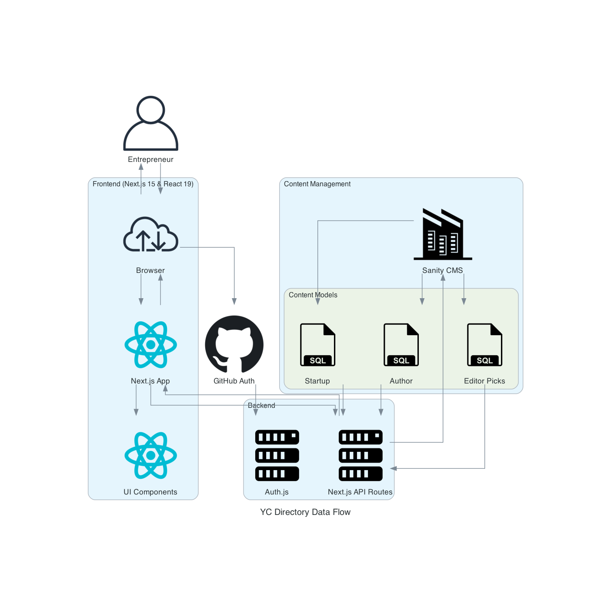
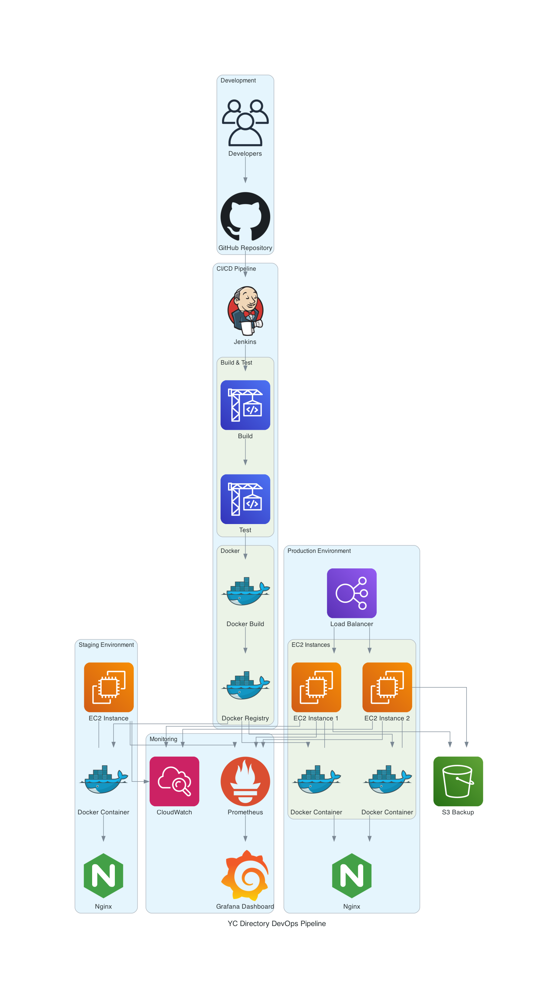

# YC Directory - Startup Pitch Platform

<div align="center">
  
  <h3>Connect. Pitch. Launch.</h3>
</div>

## 📋 Overview

YC Directory is a modern platform for entrepreneurs to submit startup ideas, browse pitches, and participate in virtual pitch competitions. The platform aims to create a vibrant ecosystem where founders can showcase their ideas, receive feedback, and connect with potential investors.

## ✨ Features

- **Pitch Submission**: Submit detailed startup pitches with multimedia support
- **Discovery**: Browse and filter pitches by category, industry, and funding stage
- **User Profiles**: Personalized profiles showcasing submitted pitches and activity
- **Editor Picks**: Curated selection of promising startups highlighted on the homepage
- **Analytics**: View counters and engagement metrics for tracking pitch popularity
- **Markdown Support**: Rich text formatting for pitch descriptions
- **Responsive Design**: Optimized for all devices from mobile to desktop


## 🏗️ Architecture

The YC Directory platform is built with a modern tech stack focused on performance, scalability, and developer experience.



### Data Flow



### DevOps Pipeline



## 🛠️ Tech Stack

- **Frontend**:
  - Next.js 15 (App Router)
  - React 19
  - TypeScript
  - Tailwind CSS
  - Radix UI Components

- **Content Management**:
  - Sanity CMS
  - Sanity Vision
  - Markdown Support

- **Authentication**:
  - NextAuth v5
  - GitHub OAuth

- **Deployment & Infrastructure**:
  - Docker
  - Jenkins CI/CD
  - Nginx

- **Monitoring**:
  - Sentry

## 🚀 Getting Started

### Prerequisites

- Node.js 18.17 or later
- npm 10.5.2 or later
- Sanity account
- GitHub OAuth App (for authentication)

### Installation

1. Clone the repository:
   
2. Install dependencies:
   ```bash
   npm install
   ```

3. Set up environment variables:
   - Copy `.env.example` to `.env.local`
   - Fill in the required values (see Environment Variables section)

4. Run the development server:
   ```bash
   npm run dev
   ```

5. Open [http://localhost:3000](http://localhost:3000) in your browser

### Environment Variables

Create a `.env.local` file with the following variables:

```
# Sanity Configuration
NEXT_PUBLIC_SANITY_PROJECT_ID=your_sanity_project_id
NEXT_PUBLIC_SANITY_DATASET=production
NEXT_PUBLIC_SANITY_API_VERSION=2023-05-03
SANITY_WRITE_TOKEN=your_sanity_write_token

# Authentication
AUTH_SECRET=your_auth_secret_key
AUTH_GITHUB_ID=your_github_oauth_app_id
AUTH_GITHUB_SECRET=your_github_oauth_app_secret
```

#### Variable Descriptions:

- **NEXT_PUBLIC_SANITY_PROJECT_ID**: Your Sanity project ID (found in Sanity dashboard)
- **NEXT_PUBLIC_SANITY_DATASET**: Sanity dataset name (usually "production")
- **NEXT_PUBLIC_SANITY_API_VERSION**: Sanity API version to use
- **SANITY_WRITE_TOKEN**: Token with write permissions for your Sanity project
- **AUTH_SECRET**: Random string used to encrypt session cookies
- **AUTH_GITHUB_ID**: GitHub OAuth App client ID
- **AUTH_GITHUB_SECRET**: GitHub OAuth App client secret

## 📁 Project Structure

```
yc_directory/
├── app/                    # Next.js App Router
│   ├── (root)/             # Main application routes
│   │   ├── startup/        # Startup pitch pages
│   │   └── user/           # User profile pages
│   ├── api/                # API routes
│   ├── components/         # App-specific components
│   └── studio/            # Embedded Sanity Studio
├── components/             # Reusable UI components
│   └── ui/                 # UI component library
├── lib/                    # Utility functions and shared code
├── public/                 # Static assets
├── sanity/                 # Sanity configuration
│   └── schemaTypes/        # Content schemas
├── .env.example            # Example environment variables
├── auth.ts                 # NextAuth configuration
├── next.config.js          # Next.js configuration
├── tailwind.config.ts      # Tailwind CSS configuration
└── sanity.config.ts        # Sanity CMS configuration
```

## 🧪 Testing

```bash
# Run linting
npm run lint

# Run tests (when implemented)
npm test
```

## 🚢 Deployment

### Docker Deployment

1. Build the Docker image:
   ```bash
   docker build -t yc-directory .
   ```

2. Run with Docker Compose:
   ```bash
   docker-compose up -d
   ```

### Production Deployment

The project includes Jenkins pipeline configuration for CI/CD deployment.

## 🤝 Contributing

Contributions are welcome! Please feel free to submit a Pull Request.

1. Fork the repository
2. Create your feature branch (`git checkout -b feature/amazing-feature`)
3. Commit your changes (`git commit -m 'Add some amazing feature'`)
4. Push to the branch (`git push origin feature/amazing-feature`)
5. Open a Pull Request
